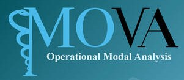

# MOVA Plugins



This repository contains a collection of Python plugins and helper scripts that facilitate interaction with the input and output files of the **MOVA** software (developed by the University of Perugia and the University of Granada).


## Repository Structure
```text
MOVA_plugins/
│
├── docs/                   # Documentation files
├── logos/                  # Logos and graphical resources
│   └── mova_logo.jpg
├── src/                    # Source code
│   ├── examples/           # Example use cases and scripts
│   ├── helpers/            # Auxiliary modules and utilities
│   └── file_i.py           # I/O scripts for MOVA files
│
└── README.md               # Project description and usage
```
## Example Plugin

- `Geometry_from_AutoCAD.py`: Converts AutoCAD files into the geometry format required by MOVA. Useful for automating the model setup phase.

## Getting Started

1. Clone this repository:
   ```bash
   git clone https://github.com/your-username/MOVA_plugins.git
